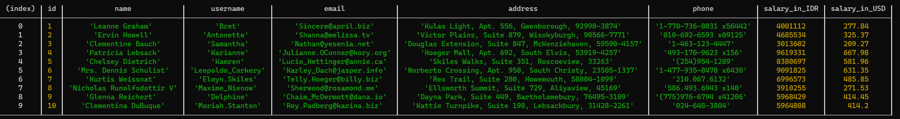
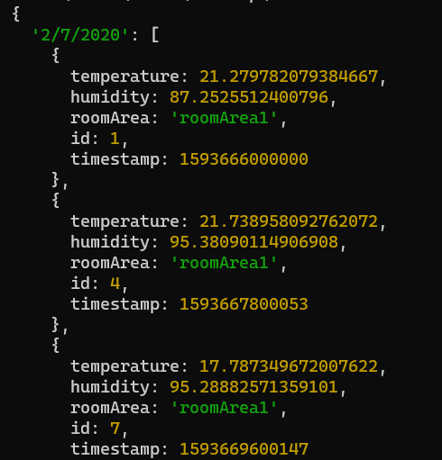
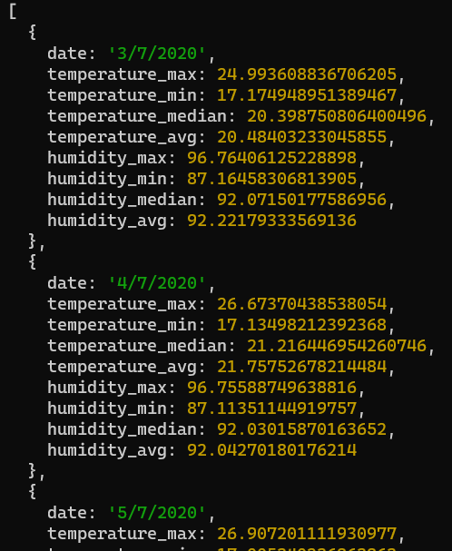
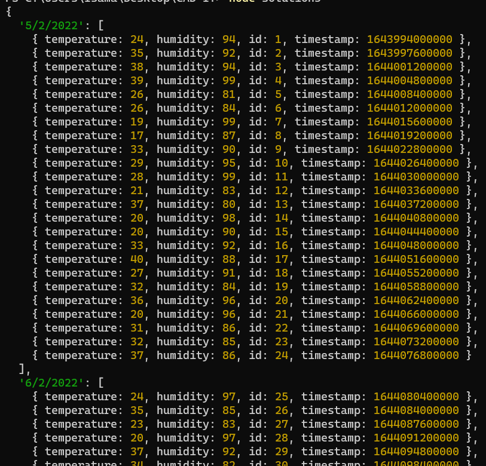
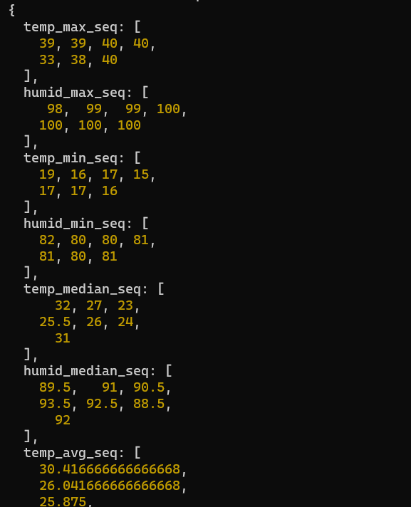
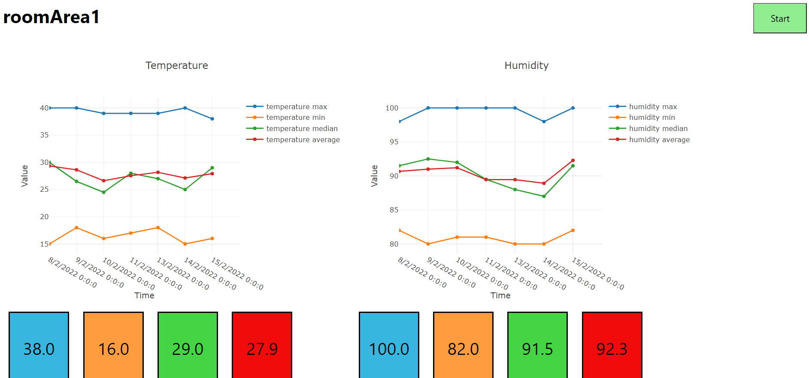

# IoT-Application-Developer-Tech-Test-Isa-Maulana
IoT Application Developer Tech Test.
Please find solution files inside repository.

* Problem 1 : solution1.js

* Problem 2 : solution2.js

* Probem 3 : solution3.js, solution3.css, solution3.html

## How to Install and Run
### Problem 1 and 2
solution1.js and solution2.js written using Javascript, run on Node.js runtime. Please install latest version of Node.js (16.13.2 LTS) on your machine to run the script.

### Problem 3
Solution for problem 3 consists of 3 files. Please find and open solution3.html on your browser to run endpoint simulation.

### Dependencies
* node-fetch 2.0
* plotly.js-dist-min 2.8.3

To install library, you can install it manually or use npm package manager. Open your machine terminal, navigate to the directory, and type :

```npm install node-fetch@2```

```npm install plotly.js-dist-min@2.8.3```

This repository already include these libraries. When you download the repository and run it on your local machine, there is no need to install one.

### Run the script
After installing Node.js, open your terminal and head to this repository folder on your machine,and then type :

```node solution1```


```node solution2```

to run solution1.js and solution2.js. And please find and open solution3.html on your browser to run the endpoint simulation.

## Expected Output
### Problem 1
When you run the script on Node.js, it is going to print table of required output data, you can zoom out the terminal if the displayed data looks stacked.



### Problem 2
When you open solution2.js on text editor. You will find commented line :

```
//Uncomment to print objects that classify sensor data based on room and date
// console.log(roomArea1);
// console.log(roomArea2);
// console.log(roomArea3);

//Uncomment to print objects that contain max, min, median and average per day data
// console.log(metrics_roomArea1);
// console.log(metrics_roomArea2);
// console.log(metrics_roomArea3);
```

Uncomment first 4 line to print result of each room sensor data, already classified by date. For example when you run ```console.log(roomArea1);```, you will expect



And last 4 lines, when run, will print max,min, median and average of sensor data per day. For example when you run ```console.log(metrics_roomArea1);```, you will expect



### Problem 3

Data generated in this solution only simulate sensor data in one room called roomArea1

```function generateDataJson(time_stamp,numberofDays)``` this function return random generated value for sensor data (raw values). On this particular case, the function output 7 days index each contain 24 sensor data and return it to ```metrics_roomArea1_json``` object.Expected result :




```function generateSequence(json)``` this function return sequence value of sensor data classified by date each contain max,min,median and average data. On this particular case, the function output 7 days index each contain 4 data (max,min,median and average data) and takes metrics_roomArea1_json as input and return it to ```graph_roomArea1``` object. Return values used as pre-simulation data for line chart before new data added using simulation. Expected result :



```function getNewData(numberofDataperDay)``` this function return new value of sensor data that contain max,min,median and average data. On this particular case, the function output 4 data (max,min,median and average data) and return it to extend the existing line chart. Return values used as new simulation data for line chart when "Start" button clicked. 


#### Endpoint Simulation
When you open solution3.html in your browser, the page will display :



Click on Start button to start simulation and Stop button to stop simulation. All squares below the chart diplay recent added values for respective sensor data.


Please find solution3.js, when you open it on text editor, all lines before this script

```
Plotly.newPlot('tester',[{
    x:graph_roomArea1.timestep,
    y:graph_roomArea1.temp_max_seq,
    type:'line',
    name:'temperature max'
    ....
```

can be executed on Node.js to see what the variables/objects contain. Comment the lines all the way down to execute it on Node.js


